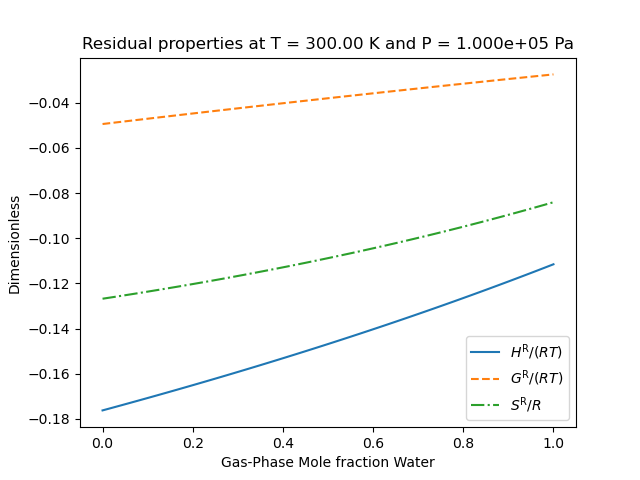

.. GasThermo documentation master file, created by
   sphinx-quickstart on Wed Apr  8 20:57:56 2020.
   You can adapt this file completely to your liking, but it should at least
   contain the root `toctree` directive.

GasThermo
=========

A package for obtaining gas-phase thermodynamic properties and computing integrals.
Designed for integration with computational simulation environments.

.. toctree::
   :maxdepth: 2
   :numbered:
   :caption: Contents:

   gettingstarted
   definitions
   mixturethermo
   eos
   input
   propertydata
   zreferences

Indices and tables
==================

* :ref:`genindex`
* :ref:`modindex`
* :ref:`search`
